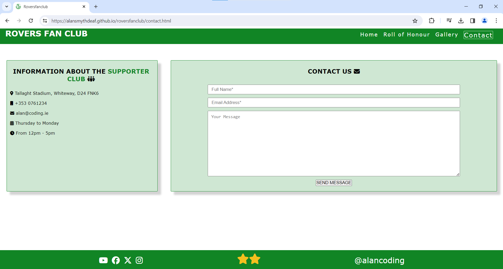

# Testing
Return back to the [README.md](README.md) file.

## Code Validation

### HTML
| Page | W3C URL | Screenshot | Notes |
| --- | --- | --- | --- |
| Home | [W3C](https://validator.w3.org/nu/?doc=https%3A%2F%2FAlanSmythDeaf.github.io%2Froversfanclub%2Findex.html) |  | Section lacks heading. Consider using h2-h6 elements to add identifying headings to all sections, or else use a div element instead for any cases where no heading is needed. |

| Roll of honour | [W3C](https://validator.w3.org/nu/?doc=https%3A%2F%2FAlanSmythDeaf.github.io%2Froversfanclub%2Findex.html) |  | Section lacks header h2-h6 warning |

| Gallery | [W3C](https://validator.w3.org/nu/?doc=https%3A%2F%2FAlanSmythDeaf.github.io%2Froversfanclub%2Findex.html) |  | Section lacks header h2-h6 warning |

| Contact | [W3C](https://validator.w3.org/nu/?doc=https%3A%2F%2FAlanSmythDeaf.github.io%2Froversfanclub%2Findex.html) |  | Section lacks header h2-h6 warning |

### CSS
I have used the recommended [CSS Jigsaw Validator](https://jigsaw.w3.org/css-validator) to validate all of my CSS files.

 File | Jigsaw URL | Screenshot | Notes |
| --- | --- | --- | --- |
| style.css | [Jigsaw](https://jigsaw.w3.org/css-validator/validator?uri=https%3A%2F%2FAlanSmythDeaf.github.io%2Froversfanclub) |  | Pass: No Errors |
|

## Browser Compatibility

I've tested my deployed project on multiple browsers to check for compatibility issues.

- [Chrome](https://www.google.com/chrome)

| Index - Home | Roll of Honour | Gallery | Contact | Notes |

 |  |  |  | Works as expected |

- [Firefox (Developer Edition)](https://www.mozilla.org/firefox/developer)

| Index - Home | Roll of Honour | Gallery | Contact | Notes |
|  |  |  |  | Works as expected |

- [Edge](https://www.microsoft.com/edge)

| Index - Home | Roll of Honour | Gallery | Contact | Notes |
 |  |  |  | Works as expected |

## Responsiveness

I've tested my deployed project on multiple devices to check for responsiveness issues.

- Mobile Phone

| Index - Home | Roll of Honour | Gallery | Contact | Notes |
|  |  |  |  |  | --- |

## Lighthouse Audit

## User Story Testing

## Bugs

## Unfixed Bugs

