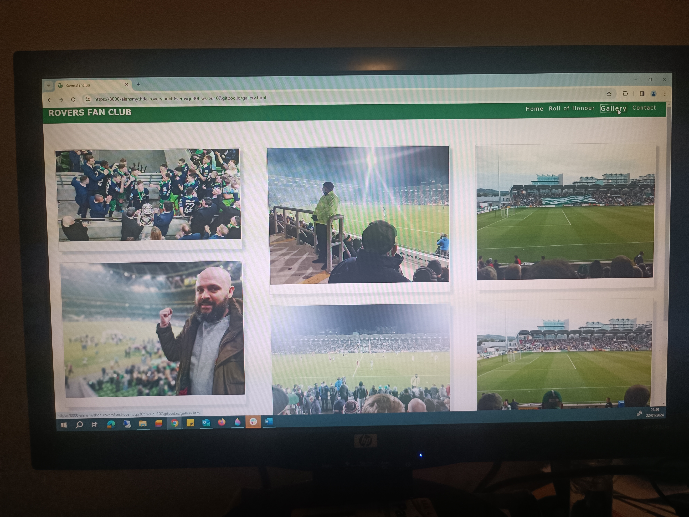
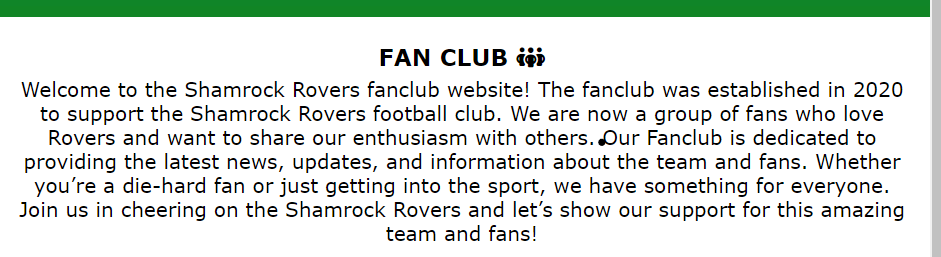

# Testing
Return back to the [README.md](README.md) file.

## Code Validation

### HTML
I have used the recommended [HTML W3C Validator](https://validator.w3.org/nu/) to validate all of my HTML files.

| Page | W3C URL | Screenshot | Notes |
| --- | --- | --- | --- |
| Home | [W3C](https://validator.w3.org/nu/?doc=https%3A%2F%2Falansmythdeaf.github.io%2Froversfanclub%2Findex.html) |  | Section lacks heading. Consider using h2-h6 elements to add identifying headings to all sections, or else use a div element instead for any cases where no heading is needed. |

| Page | W3C URL | Screenshot | Notes |
| --- | --- | --- | --- |
| Roll of honour | [W3C](https://alansmythdeaf.github.io/roversfanclub/rollofhonour.html) |  | Section lacks heading. Consider using h2-h6 elements to add identifying headings to all sections, or else use a div element instead for any cases where no heading is needed. |

| Page | W3C URL | Screenshot | Notes |
| --- | --- | --- | --- |
| Gallery | [W3C](https://validator.w3.org/nu/?doc=https%3A%2F%2Falansmythdeaf.github.io%2Froversfanclub%2Fgallery.html) |  | Section lacks heading. Consider using h2-h6 elements to add identifying headings to all sections, or else use a div element instead for any cases where no heading is needed. |

| Page | W3C URL | Screenshot | Notes |
| --- | --- | --- | --- |
| Contact | [W3C](https://validator.w3.org/nu/?doc=https%3A%2F%2Falansmythdeaf.github.io%2Froversfanclub%2Fcontact.html) |  | Section lacks heading. Consider using h2-h6 elements to add identifying headings to all sections, or else use a div element instead for any cases where no heading is needed. |

### CSS
I have used the recommended [CSS Jigsaw Validator](https://jigsaw.w3.org/css-validator) to validate all of my CSS files.

 File | Jigsaw URL | Screenshot | Notes |
| --- | --- | --- | --- |
| style.css | [Jigsaw](https://jigsaw.w3.org/css-validator/validator) |  | Pass: No Errors |
|

## Browser Compatibility

I've tested my deployed project on multiple browsers to check for compatibility issues.

- [Chrome](https://www.google.com/chrome)

| Index - Home | Roll of Honour | Gallery | Contact | Notes |

 |  |  |  | Works as expected |

- [Firefox (Developer Edition)](https://www.mozilla.org/firefox/developer)

| Index - Home | Roll of Honour | Gallery | Contact | Notes |
|  |  |  |  | Works as expected |

- [Edge](https://www.microsoft.com/edge)

| Index - Home | Roll of Honour | Gallery | Contact | Notes |
 |  |  |  | Works as expected |

## Responsiveness

I've tested my deployed project on multiple devices to check for responsiveness issues.

- Mobile Phone

| Index - Home | Roll of Honour  | Gallery | Contact |
| --- | --- | --- | --- |
|  |  |  |  | works as expected

- Tablet (Ipad Mini)

| Index - Home | Roll of Honour  | Gallery | Contact |
| --- | --- | --- | --- |
|  |  |  |  | 

- Laptop / Desktop

| Index - Home | Roll of Honour  | Gallery | Contact |
| --- | --- | --- | --- |
|  |  |  |  |

## Lighthouse Audit
I've tested my deployed project using the Lighthouse Audit tool to check for any major issues.

 - DESKTOP

| Index - Home |  | Recommended hero banner to be WebP than png |

| ROH -Roll of honour |  | Recommended image to be WebP rather than png |

| Index - Gallery |  | Recommend images that are appropriately-sized to save data and improve load time |

| Contact |  | Recommened not to use br after li |

- MOBILE

| Index - Home |  | Recommended hero banner to be WebP than png |

| ROH -Roll of honour |  | Recommended avoid large layout shifts & Recommended image to be WebP rather than png |

| Index - Gallery |  | Recommended avoid large layout shifts & proplerly size images |

| Contact |  | 

## User Story Testing

| User Story | Screenshot |
| --- | --- |
| As a new site user, I would like to easily understand the main purpose of the site and learn more about the organisation. |  |
| As a new site user, I would like to easily navigate throughout the site to find content. |  |
| As a new site user, I would like view the website and content clearly on my mobile device. |  |
| As a new site user, I would like to find ways to follow the Shamrock Rovers Fan Club on different social media platforms.|  |

| User Story | Screenshot |
| --- | --- |
| As a Returning user, I want to see the gallery section |  |
| As a Returning user,  I want to see the opening hours and days|  |

## Bugs

- When validating HTML, theSection lacks heading. Consider using h2-h6 elements to add identifying headings to all sections, or else use a div element instead for any cases where no heading is needed.

    
## Unfixed Bugs
